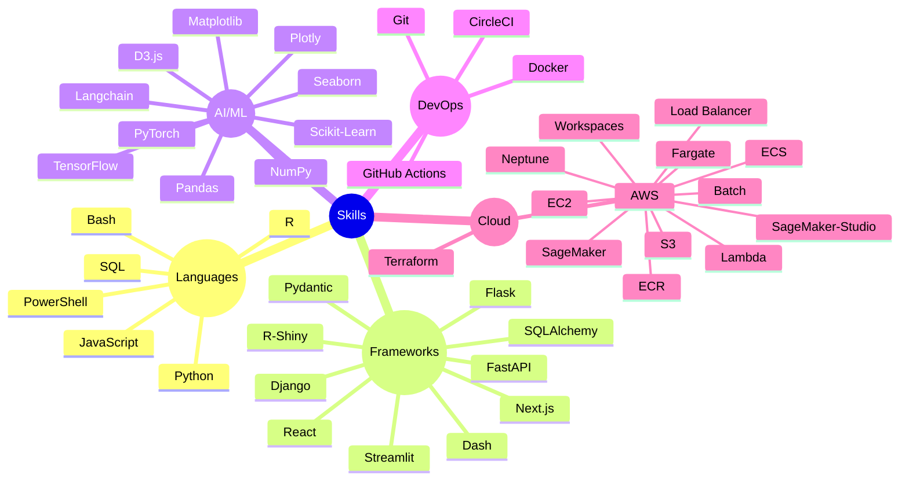
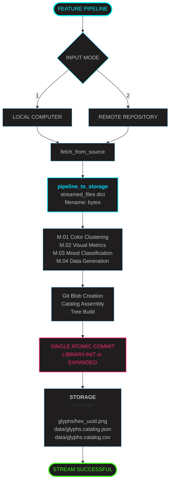

## [🚪](https://dduyg.github.io/sandbox)

<pre>

┌──┤ ABOUT ├─────────▰▰▰
│
├─▣ Building production ML pipelines & explainable AI systems
├─▣ Synthesizing logic into ML systems, where every model tells a clear story and every pipeline is built to last
├─▣ Synthesiser who builds models that are interpretable by design
│
└───────────────────────────────▰▰▰

┌──┤ PROJECTS ├───────▰▰▰
│
├─◈ <a href="#">AutoML Toolkit</a>
├─◈ <a href="#">PyTorch Training Pipeline</a>
├─◈ <a href="#">SHAP Implementation Patterns</a>
├─◈ <a href="#">Neural Architecture Search</a>
├─◈ <a href="#">Feature Engineering Library</a>
│
└───────────────────────────────▰▰▰

</pre>

> [!WARNING]
> system.log: { status: "abandoned server" }

> [!NOTE]
> Made by Duygu who appreciate smooth animations

> [!IMPORTANT]
> - [pattern-obsessed]
> - [ensemble-everything
> - [hyperparameter-tortured]
> - [latent-space-wandering]
> - [architecturally adventurous]
> - [efficiency-obsessed]

---

