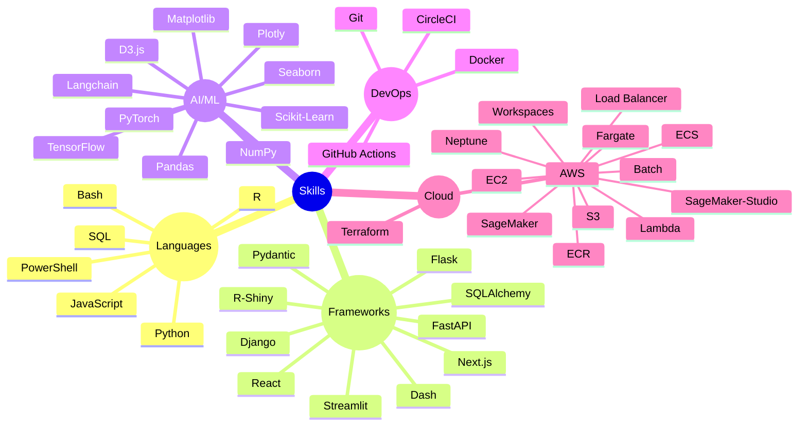

## [🚪](https://dduyg.github.io/sandbox)

<pre>

┌──┤ ABOUT ├─────────▰▰▰
│
├─▣ Building production ML pipelines & explainable AI systems
├─▣ Synthesizing logic into ML systems, where every model tells a clear story and every pipeline is built to last
├─▣ Synthesiser who builds models that are interpretable by design
│
└───────────────────────────────▰▰▰

┌──┤ PROJECTS ├───────▰▰▰
│
├─◈ <a href="#">AutoML Toolkit</a>
├─◈ <a href="#">PyTorch Training Pipeline</a>
├─◈ <a href="#">SHAP Implementation Patterns</a>
├─◈ <a href="#">Neural Architecture Search</a>
├─◈ <a href="#">Feature Engineering Library</a>
│
└───────────────────────────────▰▰▰

</pre>


> [!WARNING]
> system.log: { status: "abandoned server" }

> [!NOTE]
> Made by Duygu who appreciate smooth animations

> [!IMPORTANT]
> - [pattern-obsessed]
> - [ensemble-everything
> - [hyperparameter-tortured]
> - [latent-space-wandering]
> - [architecturally adventurous]
> - [efficiency-obsessed]

---




```mermaid
flowchart TD
    Start([⟪ GLYPH.FEATURE.PIPELINE ⟫]) --> InputMode{INPUT.MODE}
    
    InputMode -->|[1]| Local[LOCAL.COMPUTER]
    InputMode -->|[2]| Remote[REMOTE.REPOSITORY]
    
    Local --> Fetch[fetch_from_source]
    Remote --> Fetch
    
    Fetch --> Stream["streamed_files dict
    {filename: bytes}"]
    
    Stream --> Pipeline[pipeline_to_storage]
    
    Pipeline --> Processing["M.01 → Color.Clustering
    M.02 → Visual.Metrics
    M.03 → Mood.Classification
    M.04 → Metadata.Generation"]
    
    Processing --> GitOps["Git.Blob.Creation
    Catalog.Assembly [JSON+CSV]
    Tree.Build [glyphs/ + data/]"]
    
    GitOps --> Commit["⚡ SINGLE.ATOMIC.COMMIT
    [LIBRARY.INIT | LIBRARY.EXPANDED]"]
    
    Commit --> Storage["REMOTE.STORAGE
    gh_user/gh_repo"]
    
    Storage --> Structure["glyphs/[hex]_[uuid].png
    data/glyphs.catalog.json
    data/glyphs.catalog.csv"]
    
    Structure --> Success([✓ STREAM.SUCCESSFUL])
    
    style Start fill:#0a0e27,stroke:#00ff41,stroke-width:2px,color:#00ff41
    style Pipeline fill:#0d1117,stroke:#58a6ff,stroke-width:2px,color:#58a6ff
    style Commit fill:#0d1117,stroke:#f778ba,stroke-width:2px,color:#f778ba
    style Success fill:#0a0e27,stroke:#00ff41,stroke-width:2px,color:#00ff41
    style Processing fill:#161b22,stroke:#8b949e,stroke-width:1px,color:#c9d1d9
    style GitOps fill:#161b22,stroke:#8b949e,stroke-width:1px,color:#c9d1d9
    style Stream fill:#161b22,stroke:#8b949e,stroke-width:1px,color:#c9d1d9
    style Structure fill:#161b22,stroke:#8b949e,stroke-width:1px,color:#c9d1d9
    style InputMode fill:#0d1117,stroke:#58a6ff,stroke-width:1px,color:#58a6ff
    style Local fill:#161b22,stroke:#8b949e,stroke-width:1px,color:#c9d1d9
    style Remote fill:#161b22,stroke:#8b949e,stroke-width:1px,color:#c9d1d9
    style Fetch fill:#161b22,stroke:#8b949e,stroke-width:1px,color:#c9d1d9
    style Storage fill:#161b22,stroke:#8b949e,stroke-width:1px,color:#c9d1d9
```
